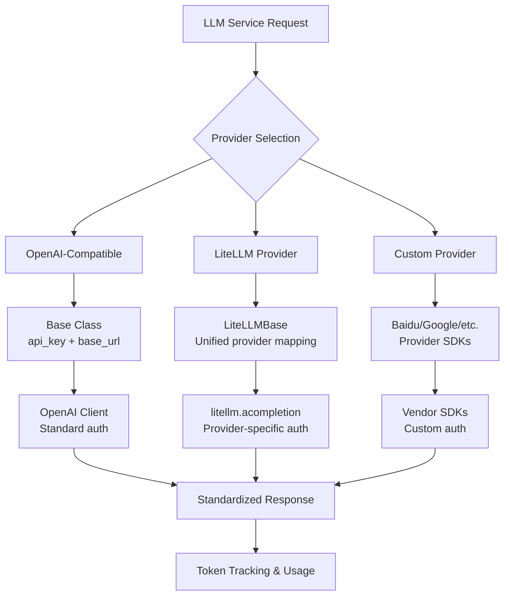
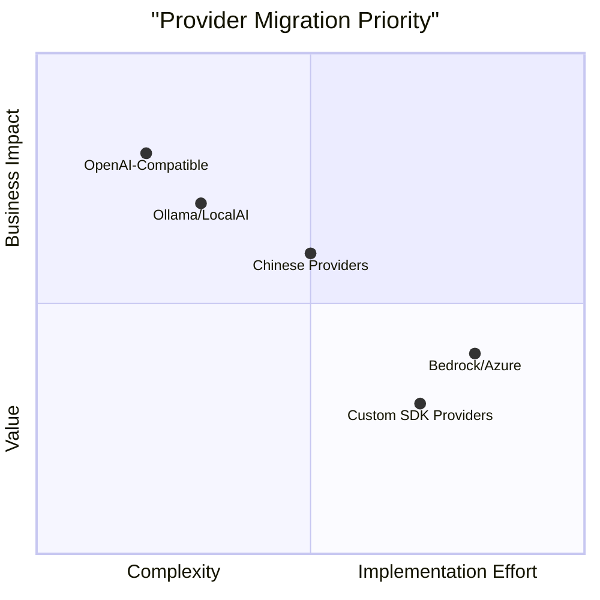

# RAGFlow LLM Provider Authentication Assessment & LiteLLM Integration Analysis

## Executive Summary

RAGFlow currently implements a sophisticated **hybrid authentication system** that supports both direct provider SDKs (OpenAI, Baidu, etc.) and LiteLLM for unified provider abstraction. After analyzing the codebase and reviewing LiteLLM documentation, I recommend **expanding LiteLLM usage** for new providers while maintaining the existing architecture for providers with complex authentication requirements (Bedrock, Azure, OpenRouter).

## Current Authentication Implementation Analysis

### Architecture Overview
RAGFlow uses a **factory pattern** with provider-specific implementations in `rag/llm/chat_models/`:

1. **Base Class** (`base.py`): Standard OpenAI-compatible authentication using `OpenAI` client
2. **LiteLLM Integration** (`litellm.py`): Unified provider abstraction for 30+ providers
3. **Provider-Specific Classes**: Custom implementations for Baidu, Google, Hunyuan, etc.

### Key Authentication Patterns Identified

### Current LiteLLM Usage
The system already extensively uses LiteLLM for **33 providers** including:
- **Cloud Providers**: Bedrock, Azure OpenAI, Google Gemini, Anthropic
- **Chinese Providers**: Tongyi-Qianwen, ZHIPU-AI, MiniMax, StepFun
- **Open Source**: Ollama, LMStudio, LocalAI, Xinference
- **Aggregators**: OpenRouter, TogetherAI, SiliconeFlow

### Complex Authentication Handlers
1. **Bedrock**: IAM role, access key, and session token caching
2. **Azure OpenAI**: JSON config with api_version
3. **OpenRouter**: Provider ordering and fallback configuration
4. **Ollama**: Bearer token injection for reverse proxy auth

## LiteLLM Capabilities Assessment

### Strengths for RAGFlow Context
1. **Unified API**: Single interface for 100+ LLM providers
2. **Automatic Authentication**: Handles provider-specific auth schemes
3. **Fallback & Load Balancing**: Built-in provider failover
4. **Cost Tracking**: Native token counting and cost calculation
5. **Streaming Support**: Consistent streaming across providers

### Limitations Observed
1. **Complex Provider Config**: Some providers (Bedrock IAM roles) still need custom handling
2. **Chinese Provider Support**: LiteLLM's Chinese provider coverage matches RAGFlow's needs
3. **Tool Calling**: RAGFlow implements custom tool calling logic that may need adaptation

## Efficiency Comparison: Current vs. Full LiteLLM

### Current Approach (Hybrid)
**Pros:**
- Optimized for specific providers with custom SDK features
- Fine-grained control over authentication flows
- Existing investment in provider-specific implementations
- Custom tool calling and streaming logic

**Cons:**
- Maintenance overhead for 20+ provider classes
- Inconsistent error handling across providers
- Duplicate retry and token counting logic
- New provider onboarding requires custom implementation

### Full LiteLLM Migration
**Pros:**
- Single implementation for all providers
- Reduced codebase by ~70% (remove 15+ provider classes)
- Consistent error handling and retry logic
- Automatic support for new LiteLLM providers
- Built-in rate limiting and load balancing

**Cons:**
- Loss of provider-specific optimizations
- Potential breaking changes for existing deployments
- Dependency on external library stability
- May still need custom wrappers for complex providers

## Recommendations

### Short-Term (1-2 Months)
1. **Consolidate LiteLLM Providers**: Migrate remaining OpenAI-compatible providers to use `litellm.py`
2. **Standardize Configuration**: Create unified JSON schema for all provider configurations
3. **Enhance LiteLLM Wrapper**: Add missing features (custom tool calling, Chinese notifications)
4. **Benchmark Performance**: Compare latency and cost between implementations

### Medium-Term (3-6 Months)
1. **Gradual Migration Path**:
   - Phase 1: New providers use LiteLLM exclusively
   - Phase 2: Migrate low-complexity providers (Spark, VolcEngine, etc.)
   - Phase 3: Evaluate complex providers (Bedrock, Azure) for migration
2. **Unified Token Tracking**: Implement consistent usage tracking across all providers
3. **Provider Abstraction Layer**: Create clean interface that can use either implementation

### Long-Term (6+ Months)
1. **Complete LiteLLM Adoption**: For all providers where feasible
2. **Contributions to LiteLLM**: Submit RAGFlow's customizations (Bedrock IAM, Chinese providers)
3. **Provider Configuration UI**: Dynamic provider registration via LiteLLM

## Risk Assessment

| Risk | Impact | Likelihood | Mitigation |
|------|--------|------------|------------|
| Breaking existing deployments | High | Medium | Maintain backward compatibility, phased rollout |
| LiteLLM library instability | Medium | Low | Pin versions, maintain fallback implementations |
| Performance regression | Medium | Medium | Comprehensive benchmarking before migration |
| Loss of provider-specific features | Low | High | Feature parity analysis before migration |

## Implementation Priority Matrix

## Conclusion

RAGFlow's current hybrid approach is **well-architected** but suffers from maintenance overhead. LiteLLM provides a **more efficient path forward** for provider abstraction, but a full migration requires careful planning.

**Immediate Action Items:**
1. Audit all provider configurations for standardization
2. Create migration test suite for each provider
3. Implement A/B testing framework to compare implementations
4. Document LiteLLM integration patterns for new providers

**Recommendation:** Adopt **progressive LiteLLM migration** starting with new providers and low-complexity existing providers, while maintaining the current architecture for providers with complex authentication requirements.

---
*Assessment completed based on analysis of RAGFlow codebase (2026-02-01) and LiteLLM documentation review*